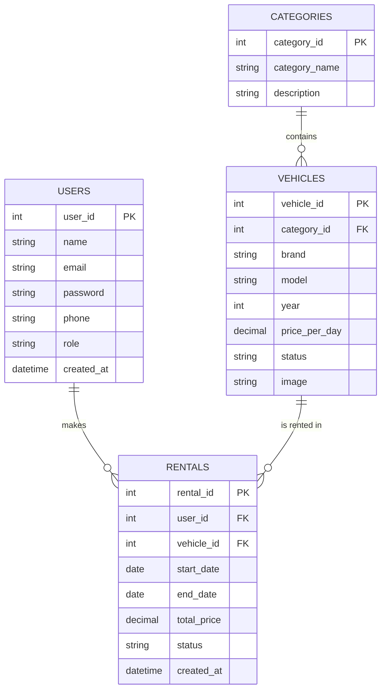
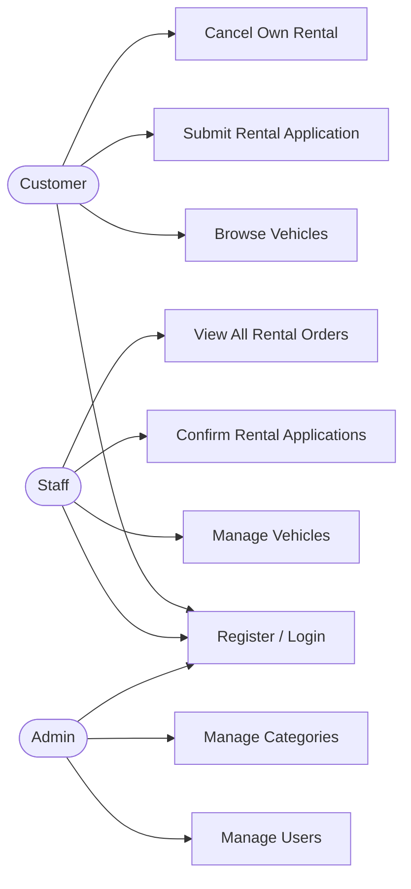

# Project Proposal: PHP + MySQL Application

> **Course:** J620-002-4:2020 Front-End Software Development (Level 4)
> **Competency Unit:** J620-002-4:2020-C01

---

## 1. Student Details

| Field | Your Answer |
|---|---|
| Candidate Name | [ KHOO YONG JIAN ] |
| NRIC Number | [ 080722-07-0629 ] |
| Date Submitted | [  ] |

---

## 2. Project Title

**Car Rental Management System**

### One-line summary
A web-based car rental platform where customers can browse and rent vehicles online, staff manage vehicles and rental applications, and admins oversee users and categories.

---

## 3. Problem Statement & Purpose

Traditional car rental processes often rely on phone calls, walk-ins, or manual paperwork, which can be slow and error-prone for both customers and rental staff. Customers have no easy way to check vehicle availability or pricing in advance, and staff have to manually track which vehicles are rented out, available, or under maintenance.

This system solves that problem by providing an online platform where customers can browse available vehicles, view pricing and details, and submit rental applications without needing to visit or call the rental office. Staff manage the vehicle fleet and process rental applications, while admins oversee user accounts and vehicle categories — reducing manual work and minimizing booking conflicts.

---

## 4. Tech Stack

| Layer | Technology |
|---|---|
| Markup | HTML5 |
| Styling | CSS3 |
| Server-side | PHP |
| Database | MySQL |

---

## 5. Types of Users (Roles)

> Meets minimum requirement: at least 2 roles with role-based access (this design uses 3).

| Role | Description |
|---|---|
| Customer | Regular users who browse vehicles and submit rental applications. |
| Staff | Handles day-to-day rental operations — manages vehicles and confirms rental applications. |
| Admin | Manages the overall system — users and vehicle categories. |

### Role-Based Access Matrix

| Feature / Page | Customer | Staff | Admin |
|---|:---:|:---:|:---:|
| Register / Login | ✅ | ✅ | ✅ |
| Browse / view vehicles | ✅ | ✅ | ✅ |
| Submit rental application | ✅ | ❌ | ❌ |
| Cancel rental application | ✅ | ❌ | ❌ |
| Add / edit / delete vehicles | ❌ | ✅ | ❌ |
| Confirm rental applications | ❌ | ✅ | ❌ |
| Manage vehicle categories | ❌ | ❌ | ✅ |
| Manage all users | ❌ | ❌ | ✅ |

---

## 6. Features

### 6.1 Core Features (must have)

- [ ] User registration and login
- [ ] Role-based access control (each role sees/does different things)
- [ ] Data management (Create, Read, Update, Delete)
- [ ] Vehicle browsing
- [ ] Rental application submission and confirmation workflow

### 6.3 Feature Descriptions

| Feature | Description | Role(s) |
|---|---|---|
| Vehicle browsing | Customers can view all vehicles and see details like price and status. | Customer, Staff, Admin |
| Rental application | Customers submit a rental request with start/end dates for a chosen vehicle; the system calculates the total price. | Customer |
| Rental confirmation | Staff reviews pending rental applications and confirms them, updating the rental and vehicle status accordingly. | Staff |
| Vehicle management | Staff can add new vehicles, edit vehicle details, update vehicle status, or remove vehicles from the fleet. | Staff |
| User & category management | Admin manages all user accounts and manages vehicle categories used across the system. | Admin |

---

## 7. Data Management System

| Data / Entity | Create | Read | Update | Delete |
|---|---|---|---|---|
| Users | Customer (self-register), Admin (create Staff/Admin accounts) | Admin | Admin, Customer (own profile) | Admin |
| Vehicles | Staff | Customer, Staff, Admin | Staff | Staff |
| Categories | Admin | Customer, Staff, Admin | Admin | Admin |
| Rentals | Customer | Customer (own), Staff, Admin | Staff (status) | Customer (own, if pending) |

---

## 8. Database Design

> Minimum **4 tables** with at least **3 linkages** (foreign keys) between them. This design uses **4 tables** with **3 linkages**.

### Tables

1. **users** — `user_id`, `name`, `email`, `password`, `phone`, `role`, `created_at`
2. **categories** — `category_id`, `category_name`, `description`
3. **vehicles** — `vehicle_id`, `category_id` (FK), `brand`, `model`, `year`, `price_per_day`, `status`, `image`
4. **rentals** — `rental_id`, `user_id` (FK), `vehicle_id` (FK), `start_date`, `end_date`, `total_price`, `status`, `created_at`

### Relationships

1. `users` → `rentals` (1:N) — one user can have many rentals
2. `vehicles` → `rentals` (1:N) — one vehicle can appear in many rentals over time
3. `categories` → `vehicles` (1:N) — one category can contain many vehicles

### Entity Relationship Diagram (ERD)

---

## 9. Use Case Diagram

---

## 10. Presentation Checklist

- [ ] Can explain the purpose of the application
- [ ] Can justify design choices (why this database structure, why these roles)
- [ ] Can demo every role
- [ ] Can answer questions about my own code
- [ ] Submitted on time
